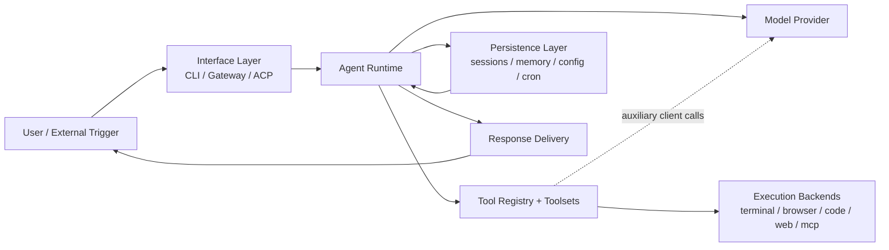
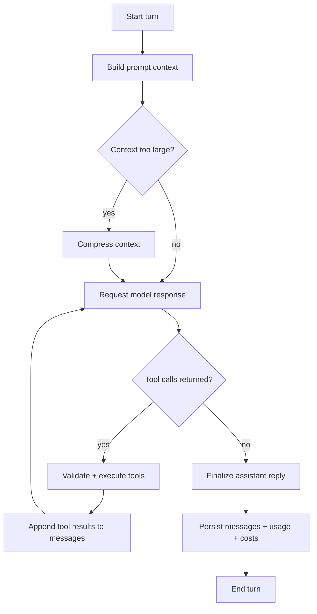
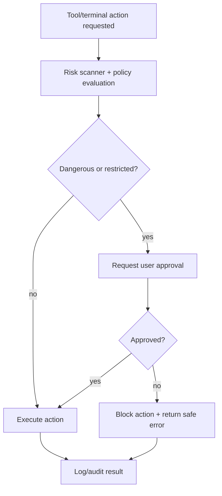
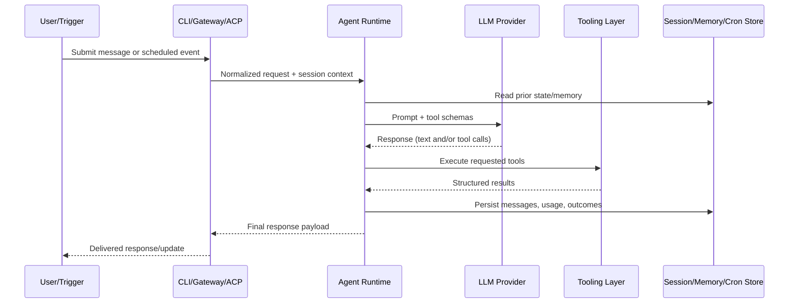

# Product Requirements Document (PRD)
## Hermes Agent Reverse Engineering Specification

## 1) Executive Summary / Product Overview

Hermes Agent is a general-purpose, tool-using AI agent platform designed for:
- interactive local use (CLI),
- asynchronous and multi-user operation (messaging gateway),
- automation (scheduled jobs),
- software and research workflows (tool orchestration, delegation, RL/trajectory tooling), and
- extensibility (tool registry, MCP servers, skills, plugins, ACP editor protocol).

The product behaves as a **stateful orchestration layer** around LLMs: it assembles context, chooses model/provider routing, executes tools, persists conversation state, and returns useful outputs across many interfaces.

Core product principles:
- Model-agnostic operation with provider routing and fallback
- Tool-first execution for grounded actions
- Session continuity via storage, memory, and search
- Cost/performance controls (prompt caching, compression, smart routing)
- Extensible architecture for tools, skills, and platforms
- Safe-by-default posture for dangerous operations

---

## 2) Core Architecture Overview

### 2.1 Major Runtime Subsystems

1. **Agent Runtime**
   - Main conversation loop, tool-call lifecycle, model invocation, retries, iteration budgeting.

2. **Tooling Layer**
   - Tool registry + toolset resolution + execution dispatch.
   - Built-in tools (terminal, files, web, browser, delegation, code execution, memory, cron, messaging, etc.) plus dynamic MCP tools.

3. **Interfaces**
   - CLI app for interactive terminal sessions.
   - Gateway service for chat platforms (api_server, dingtalk, discord, email, homeassistant, mattermost, matrix, signal, slack, sms, telegram, webhook, whatsapp).
   - ACP adapter for IDE/editor clients.

4. **Persistence & State**
   - SQLite session/message store with FTS5 search.
   - Filesystem state for config, skills, memories, cron data, process checkpoints.

5. **Optimization Services**
   - Context compression engine.
   - Prompt caching controls.
   - Auxiliary model routing for non-primary tasks.

6. **Research & Training Toolchain**
   - Batch trajectory generation.
   - Trajectory compression.
   - RL environment integration.

### 2.2 High-Level Data Plane

User/Platform Input → Interface Adapter → Agent Loop → LLM + Tools → Post-processing/Persistence → Output Delivery

### 2.3 System Context Diagram

---

## 3) Agent Conversation Loop Specification

### 3.1 Inputs
- User message
- Optional system override/context
- Conversation history
- Session metadata (platform, model config, routing constraints)

### 3.2 Core Flow
1. Initialize run state (task/session IDs, budget counters, callbacks).
2. Build/reuse system prompt (identity, memory snapshot, skill index, context files, platform hints).
3. Perform preflight context pressure check and optional compression.
4. Prepare model request (provider mode, cache-control hints, ephemeral turn additions).
5. Invoke model.
6. If tool calls are returned:
   - validate tool names,
   - run sequentially or in parallel when safe,
   - attach tool outputs,
   - continue loop.
7. If no tool calls are returned: finalize assistant response.
8. Persist messages, usage, costs, and session updates.
9. Return final response payload.

### 3.3 Reliability & Control
- Iteration budget shared with delegated children.
- Structured retry policy for malformed outputs/tool arguments.
- Interrupt propagation to running children/tools.
- Optional fallback model routing during provider/model failures.

### 3.4 Conversation Loop Diagram

---

## 4) Tool System Specification (Extensive Built-in Tooling)

### 4.1 Tool Registry Model
Each tool is registered with:
- name
- toolset category
- JSON schema
- execution handler
- availability check(s)
- required environment variables
- async metadata

### 4.2 Resolution & Dispatch
- Toolsets are resolved recursively (with include graphs and cycle guards).
- Enabled/disabled toolsets determine visible tool schemas per session/platform.
- Dispatch supports sync/async tool handlers and pre/post hooks.

### 4.3 Functional Categories
- **Terminal/process management**
- **File IO/search/patching**
- **Web search/extraction**
- **Browser automation**
- **Vision/image generation**
- **Code execution sandbox**
- **Subagent delegation**
- **Memory/todo/session search**
- **Scheduling/messaging/integrations**
- **Home automation and optional provider-specific capabilities**

### 4.4 Dynamic Extension
- MCP server discovery registers remote tools at runtime.
- Plugin architecture can add toolsets/tools without core loop changes.

---

## 5) CLI Interface Specification

### 5.1 Experience Goals
- Fast interactive chat experience.
- Rich terminal UX (status, spinner, previews, command completion).
- Strong operational controls (model/toolset/config/session/cron/skills).

### 5.2 Core Capabilities
- Slash command registry-driven command handling.
- Session management (/new, /resume, /history, /retry, /undo).
- Runtime control (/model, /provider, /reasoning, /tools, /toolsets).
- Workflow control (/background, /queue, /rollback, /stop).
- Skills and MCP controls.
- Optional voice/TTS and browser-session controls.

### 5.3 Visual Layer
- Theme/skin engine for branding/colors/spinner behavior/tool prefixes.
- Rich + prompt-toolkit composition for responsive TUI behavior.

---

## 6) Gateway / Messaging Platform Integrations

### 6.1 Gateway Responsibilities
- Connect adapters for enabled platforms.
- Normalize incoming events.
- Maintain session-keyed cached agent instances.
- Route slash commands and normal messages.
- Deliver outputs/media/status updates.

### 6.2 Platform Adapter Contract
Adapters expose common lifecycle and messaging APIs:
- connect/disconnect
- send text/media/typing signals
- parse inbound events to normalized message envelopes

### 6.3 Supported Integrations
api_server, dingtalk, discord, email, homeassistant, mattermost, matrix, signal, slack, sms, telegram, webhook, and whatsapp.

Platform names above are canonical runtime identifiers (matching `Platform` enum values).

---

## 7) Configuration System

### 7.1 Sources
- User config file
- Environment variables (.env)
- Runtime overrides (CLI/gateway flags)

### 7.2 Config Domains
- Model/provider/base URL defaults
- Tool and terminal backend settings
- Compression/caching behavior
- Display and UX preferences
- Platform-specific integration credentials
- Security and approval behavior

### 7.3 Requirements
- Backward-compatible migrations for schema evolution.
- Secure permissions for secret-containing files.
- Consistent loaders across CLI, setup tools, and gateway runtime.

---

## 8) Memory, Session, and Skills Systems

### 8.1 Session Persistence
- Structured session/message storage.
- Token/cost accounting.
- Search across sessions via full-text indexing.

### 8.2 Persistent Memory
- Curated memory stores for agent/user-level durable notes.
- Threat scanning and sanitization for memory writes.
- Frozen prompt snapshot semantics for cache stability.

### 8.3 Skills
- Reusable procedural modules described with metadata.
- Discovery, install, activation, and platform/tool-compat filtering.
- Skill invocation as structured context injection.

---

## 9) Context Compression and Prompt Caching

### 9.1 Compression Requirements
- Trigger before context-window exhaustion.
- Preserve conversation safety invariants (tool-call/result structure).
- Keep high-value recent context + compact historical summary.

### 9.2 Prompt Caching Requirements
- Preserve stable prompt prefixes across turns.
- Add cache-control markers strategically (system + recent messages).
- Avoid cache-breaking operations mid-session.

---

## 10) Subagent Delegation and Parallelism

### 10.1 Delegation Model
- Parent agent can spawn child agents for isolated subtasks.
- Child sessions inherit constrained execution context and explicit toolset limits.

### 10.2 Safety/Control Requirements
- Maximum delegation depth and concurrency limits.
- Shared budget accounting to prevent runaway recursion.
- Block recursive/unsafe capabilities in children where appropriate.

### 10.3 Result Contract
Each child returns structured summary, status, duration, usage metrics, and tool trace metadata.

---

## 11) Scheduling (Cron) System

### 11.1 Job Lifecycle
- Define schedule + prompt + delivery target.
- Persist jobs in storage.
- Tick scheduler evaluates due jobs with locking.
- Execute jobs and persist outputs.

### 11.2 Delivery Modes
- Origin chat/platform
- Explicit platform target
- Local/file delivery

### 11.3 Requirements
- Duplicate tick protection.
- Recoverable state after restart.
- Clear auditability of runs and outputs.

---

## 12) Authentication & API Integrations

### 12.1 Provider Authentication
- API-key providers (environment/.env/config).
- OAuth/device-code style flows where supported.
- Runtime credential resolution per provider.

### 12.2 Integration Surfaces
- LLM providers
- Web/search/image APIs
- Messaging APIs
- MCP servers
- Optional enterprise/community integrations

### 12.3 Requirements
- Provider-agnostic credential abstraction.
- Strong redaction practices in errors/logs.
- Graceful degradation when integrations are unavailable.

---

## 13) Security Model

### 13.1 Command Safety
- Detect dangerous terminal command patterns.
- Require explicit approval paths (once/session/always).
- Optional smart assessment pipeline prior to approval prompt.

### 13.2 Prompt/Memory Safety
- Prompt-injection scanning on contextual files/memory writes.
- Invisible character and exfiltration pattern detection.

### 13.3 Operational Security
- Sandboxed execution boundaries where possible.
- Credential filtering and redaction in tool outputs.
- Per-session/process isolation for long-running tasks.

### 13.4 Permission and Approval Model

#### Capability Domains
- **Read-only capabilities**: list/read/search files, read session history, fetch web content.
- **Mutating local capabilities**: file write/patch, terminal command execution, process control.
- **External side-effect capabilities**: messaging sends, network calls, browser actions, third-party API calls.
- **Privilege-sensitive capabilities**: shell commands that can modify system state, install software, or access sensitive paths.

#### Approval Boundaries
- Safe operations may execute without interruption when policy allows.
- Dangerous operations require explicit approval (per command/per session/per always modes).
- Messaging/gateway sessions enforce interactive approval prompts before executing sensitive terminal commands.
- Child/subagent actions inherit parent constraints and may be further restricted.

#### Approval Terminology
- **Policy-gated approval**: an approval requirement determined by configured safety/approval policy.
- **Interactive approval**: a real-time user prompt requiring explicit user confirmation.
- **Denied by policy**: action is blocked without an approval path in the current context.
- **Scoped (delegation)**: restricted to parent-assigned toolsets, inherited policy constraints, and shared iteration/runtime budgets.

#### Permission Matrix (Requirement-Level)

| Actor / Context | Read-only | Local mutation | External side effects | Dangerous command execution |
|---|---|---|---|---|
| CLI user-approved session | Allowed | Allowed | Allowed | Policy-gated approval (interactive when required) |
| Gateway user session | Allowed | Allowed | Allowed | Policy-gated approval with interactive confirmation |
| Child delegated agent | Allowed (scoped) | Allowed (scoped) | Allowed (scoped) | Denied by policy or policy-gated by parent constraints |
| Scheduled cron execution | Allowed (job-scoped) | Allowed (job-scoped) | Allowed (target-scoped) | Policy-gated approval per configured safety rules |

#### Approval Flow Diagram

---

## 14) Batch / Trajectory Generation and RL Research Capabilities

### 14.1 Batch Runner
- Run large prompt datasets through the agent.
- Save trajectories with checkpoint/resume support.
- Collect tool/reasoning usage statistics.

### 14.2 Trajectory Compression
- Post-process trajectories into target token budgets.
- Preserve instruction/action quality for training use.

### 14.3 RL Integration
- Environment adapters for benchmark/training workflows.
- Tool-call parsing variants per model family.
- Structured outputs for reward and analysis pipelines.

---

## 15) Editor Integration (ACP Adapter)

### 15.1 Objectives
- Expose Hermes agent sessions to IDE/editor clients.
- Preserve core runtime semantics (tools, streaming, session continuity).

### 15.2 Core Features
- Session create/load/fork/cancel.
- Tool progress and response streaming callbacks.
- Permission/approval bridge into editor context.

---

## 16) Non-Functional Requirements

1. **Reliability**
   - Robust retries and failure isolation.
   - Crash-safe file writes and checkpointing.

2. **Performance**
   - Prompt caching, compression, and smart routing.
   - Parallelizable tool execution where safe.

3. **Scalability**
   - Multi-session gateway operation.
   - Extensible tools/platforms without core rewrites.

4. **Observability**
   - Usage/cost accounting.
   - Structured logs and tool traces.

5. **Portability**
   - Multi-backend terminal execution.
   - Multi-platform messaging integrations.

6. **Maintainability**
   - Registry-driven extensibility.
   - Clear separation of runtime, interfaces, persistence, and integrations.

---

## 17) Data Flows and Interfaces

### 17.1 Primary Conversation Flow
1. Input received (CLI/Gateway/ACP)
2. Session context lookup
3. Agent loop execution
4. Tool orchestration
5. State persistence (messages/tokens/cost)
6. Response delivery

### 17.2 Tool Execution Flow
1. Model emits tool call(s)
2. Validate + dispatch from registry
3. Execute in selected backend/environment
4. Return structured output
5. Continue model loop

### 17.3 Scheduled Automation Flow
1. Scheduler tick identifies due job
2. Instantiate execution context
3. Run agent task
4. Persist output artifact
5. Deliver to target channel

### 17.4 Integration Interface Patterns
- **Synchronous RPC-style**: local tool handlers
- **Asynchronous event-driven**: gateway platform adapters
- **Protocol bridge**: ACP and MCP server/client boundaries

### 17.5 End-to-End Data Flow Diagram

---

## 18) Acceptance Criteria for This Reverse-Engineering PRD

The PRD is complete when it:
- covers each requested subsystem section,
- defines functional and non-functional expectations,
- describes runtime/data flows and extensibility boundaries,
- remains implementation-aware but tech-stack-agnostic in requirement language.
